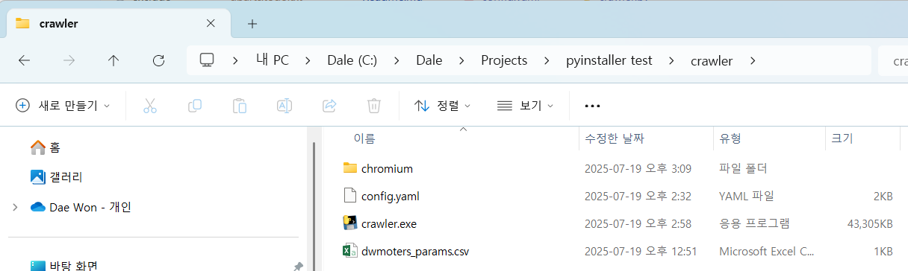
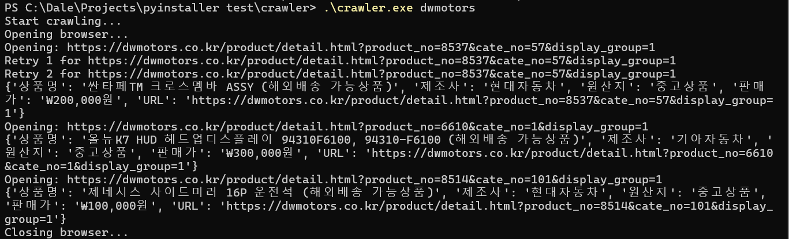

# Setup
## Python
1. Go to [Python Download](https://www.python.org/downloads)
2. Download Python 3.13.x and install
## Virtual environment
```
python -m venv venv
venv\Scripts\activate
```
## Packages
- For crawling in stealth mode
  - Install playwright
  ```
  pip install playwright
  python -m playwright install
  ```
  - Copy Chromium-<version> (e.g. chromium-1179) folder from  %USERPROFILE%\AppData\Local\ms-playwright to crawler folder.
  - Rename it to chromium. e.g. chromium-1179 to chromium
- YAML configuration
```
pip install pyyaml
```
## GIT Clone
```
git clone https://github.com/isbicf/Crawlift.git
```

# Run
...\Clawlift\crawler> python .\crawler.py <Crawling Key in config.yaml>
```
e.g.
...\Clawlift\crawler> python .\crawler.py dwmoters
```

# Build executable file (Windows)
1. Install PyInstaller
```
pip install pyinstaller
```
2. Build
```
pyinstaller --onefile --name crawler crawler.py
```
3. Test the .exe on a clean environment:
- Clean environment
  - Does not have Python
  - Does not have Playwright installed
- Copy the executable file, Chromium and configuration\
  
  - chromium folder
  - config.yaml
  - crawler.exe
  - dwmoters_params.cs
- Run
```
.\crawler.exe <Crawling Key>
```
  

# TroubleShooting
## Website Connection Timeout
- e.g. ERR_CONNECTION_TIMED_OUT
- Check your internet connection.
- Check the URL with your browser.
- Use another IP or VPN as crawling may be blocked. 
## Parameters Loading Error
- Error 
```
(venv) PS C:\Dale\Projects\Crawlift\crawler> python .\crawl.py dwmoters
Error: loading parameters from file: expected str, bytes or os.PathLike object, not NoneType
No parameters given.
```
- Check typos in the crawling key. e.g. dwmoters -> dwmotors
